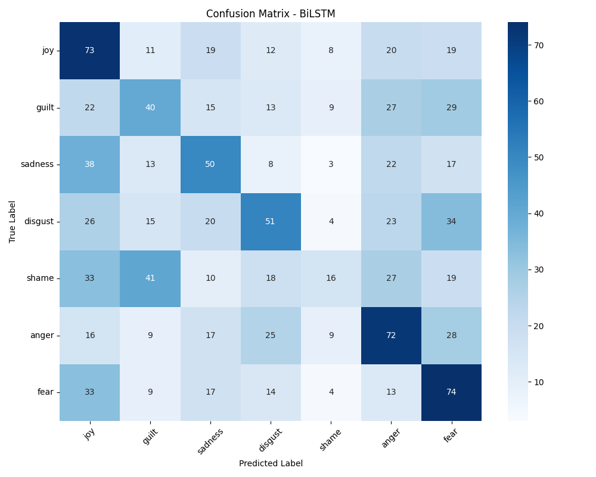
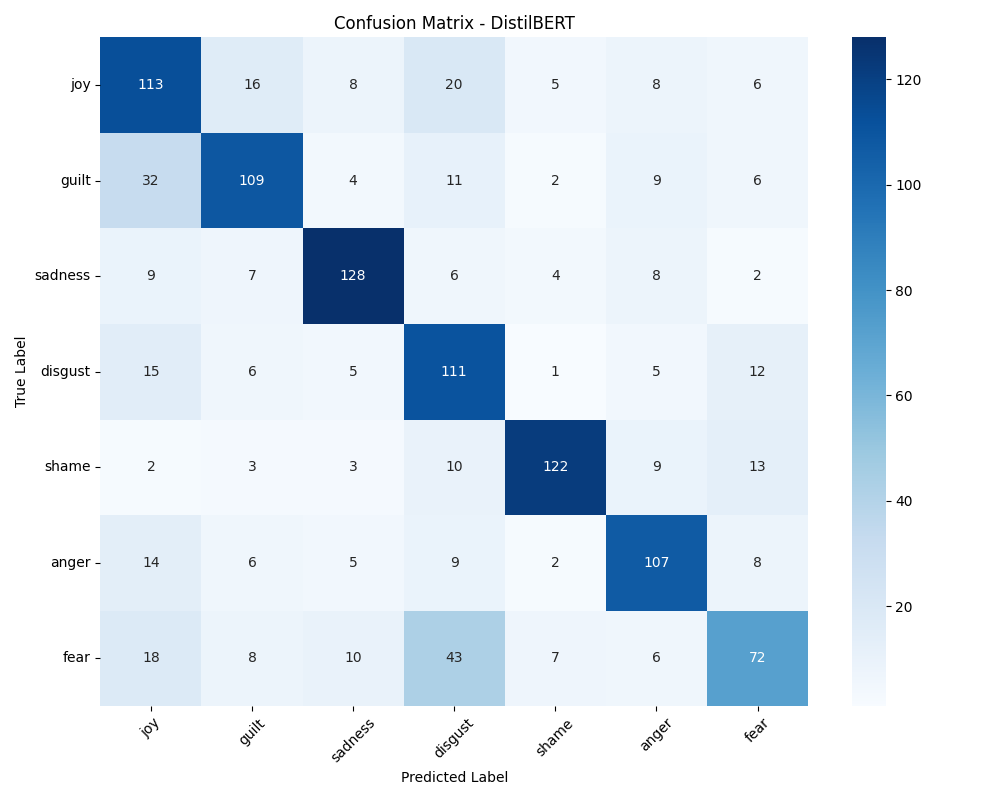
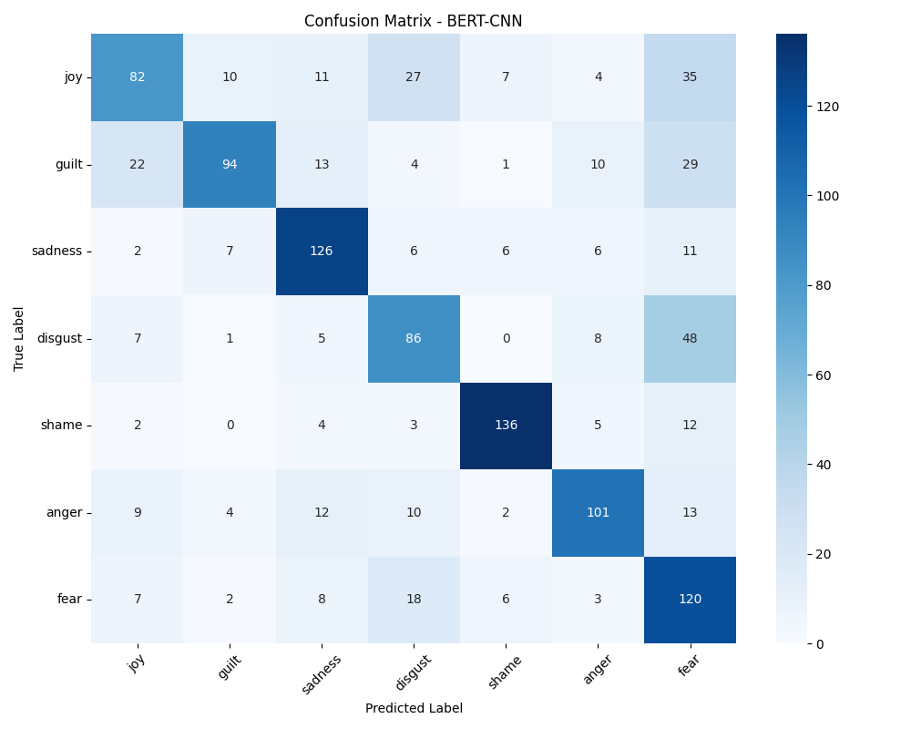

# Model Evaluation Reports

## BiLSTM

**Final Results:**
- Accuracy: 0.3345
- F1-Score: 0.3270

### Classification Report
| Class   |   Precision |   Recall |   F1-Score |   Support |
|:--------|------------:|---------:|-----------:|----------:|
| anger   |        0.35 |     0.41 |       0.38 |       176 |
| disgust |        0.36 |     0.29 |       0.32 |       173 |
| fear    |        0.34 |     0.45 |       0.39 |       164 |
| guilt   |        0.29 |     0.26 |       0.27 |       155 |
| joy     |        0.3  |     0.45 |       0.36 |       162 |
| sadness |        0.34 |     0.33 |       0.33 |       151 |
| shame   |        0.3  |     0.1  |       0.15 |       164 |
### Confusion Matrix

## DistilBERT

**Final Results:**
- Accuracy: 0.6585
- F1-Score: 0.6609

### Classification Report
| Class   |   Precision |   Recall |   F1-Score |   Support |
|:--------|------------:|---------:|-----------:|----------:|
| anger   |        0.7  |     0.71 |       0.71 |       151 |
| disgust |        0.53 |     0.72 |       0.61 |       155 |
| fear    |        0.61 |     0.44 |       0.51 |       164 |
| guilt   |        0.7  |     0.63 |       0.66 |       173 |
| joy     |        0.56 |     0.64 |       0.6  |       176 |
| sadness |        0.79 |     0.78 |       0.78 |       164 |
| shame   |        0.85 |     0.75 |       0.8  |       162 |
### Confusion Matrix

## BERT-CNN

**Final Results:**
- Accuracy: 0.6751
- F1-Score: 0.6772

### Classification Report
| Class   |   Precision |   Recall |   F1-Score |   Support |
|:--------|------------:|---------:|-----------:|----------:|
| anger   |        0.74 |     0.67 |       0.7  |       151 |
| disgust |        0.56 |     0.55 |       0.56 |       155 |
| fear    |        0.45 |     0.73 |       0.56 |       164 |
| guilt   |        0.8  |     0.54 |       0.65 |       173 |
| joy     |        0.63 |     0.47 |       0.53 |       176 |
| sadness |        0.7  |     0.77 |       0.73 |       164 |
| shame   |        0.86 |     0.84 |       0.85 |       162 |
### Confusion Matrix

